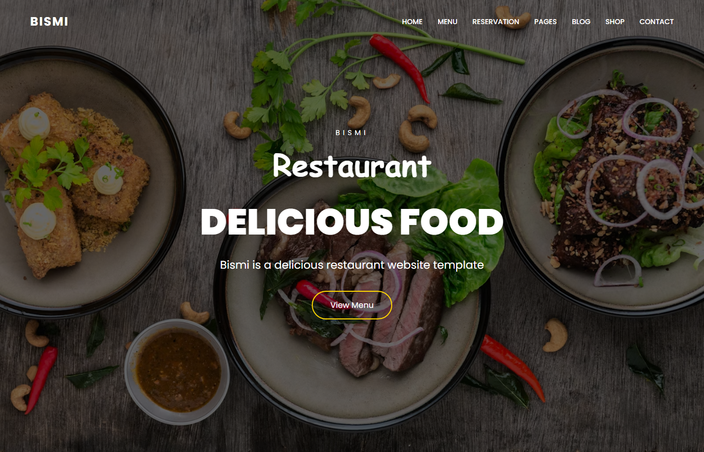

# 02 - Restaurant Homepage 🍽️

A modern restaurant landing page with a full-screen hero section, transparent navbar, and a clean "View Menu" call-to-action.

## 📝 Description

The "Bismi Restaurant" homepage uses a dark food-photo hero (sourced from Unsplash) with a semi-transparent black overlay, white "BISMI / Restaurant / DELICIOUS FOOD" headline, and a navbar with seven links (Home, Menu, Reservation, Pages, Blog, Shop, Contact).

## ✨ Features

- Full-viewport hero section with background image + dark overlay
- Custom Poppins Google Font
- Transparent fixed navbar with logo + 7 navigation links
- Gradient "View Menu" call-to-action button
- Separate `restaurant.css` for clean styling

## 🛠️ Tech Stack

- HTML5
- CSS3 (external `restaurant.css`)
- Google Fonts (Poppins)

## ▶️ How to Run

```bash
# Both files must be in the same folder:
#   index.html
#   restaurant.css
start index.html
```

Or open `index.html` in your browser of choice.

## 📸 Screenshot



## 🧠 Concepts Practiced

- Separating HTML and CSS into different files
- Google Fonts integration
- Background images with `background-size: cover`
- Linear gradient overlays for readability
- Flexbox navigation bar
- Hero section layout with centered content
