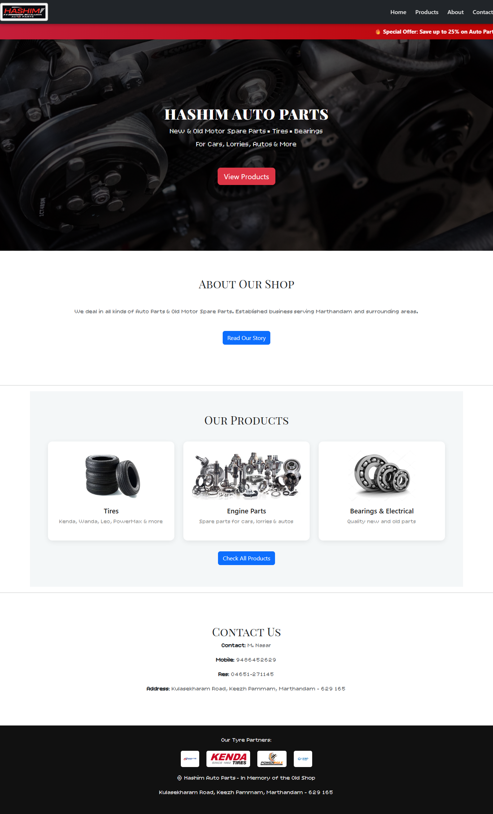
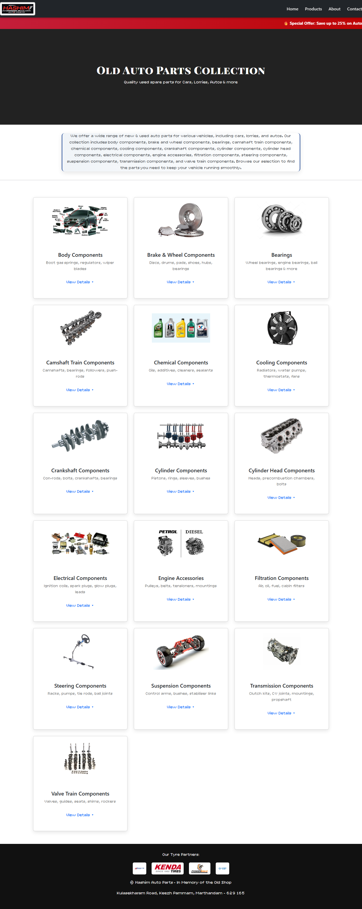
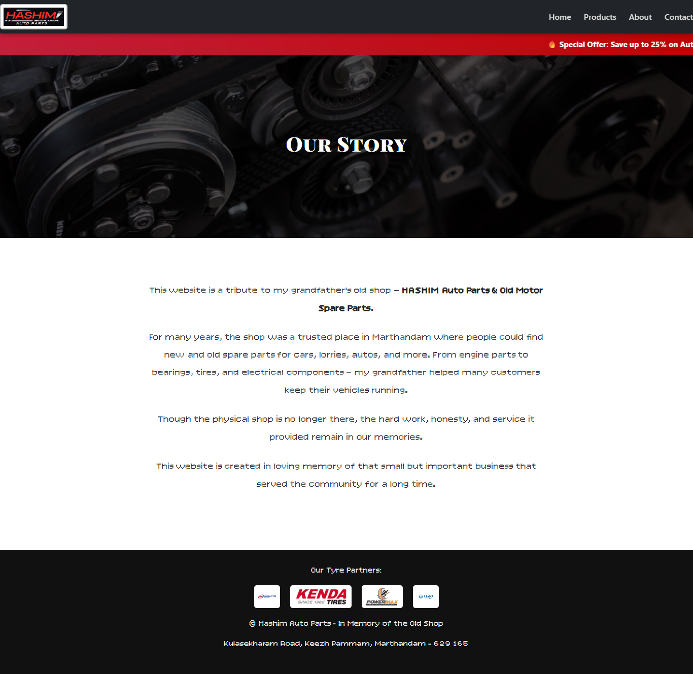
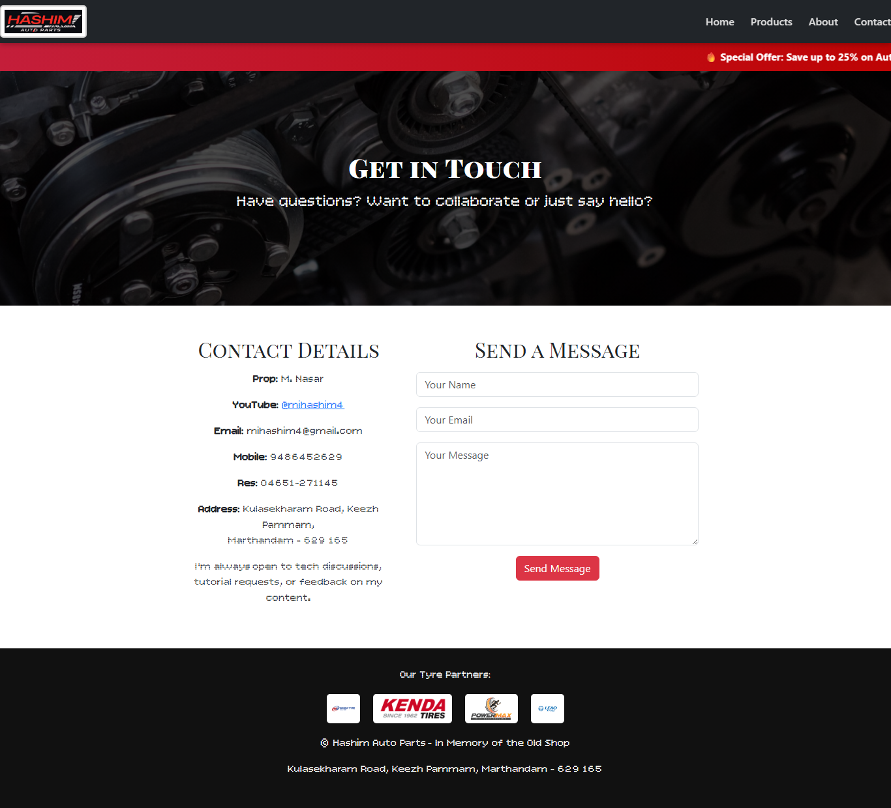

# 05 - Hashim Auto Parts (React Version) ⚛️

A React + React Router rewrite of the static Hashim Auto Parts website, with a shared navbar/footer, four route-level pages, and Bootstrap-based grid layouts.

## 📝 Description

This is the React version of the same tribute project from `04-Front-End-Project`. The app uses:

- **React 19** as the UI library
- **React Router v6** for client-side routing across 4 pages
- **Bootstrap 5** for layout grids and utility classes
- A shared `Navbar` and `Footer` component
- `useState` to toggle "View Details" on each product card

## ✨ Features

- 4 routed pages: Home, Products, About, Contact
- Reusable Navbar and Footer components
- 16 product categories on the Products page, each expandable
- Contact page with a "send message" form
- Hero section, special-offers bar, and tyre-partners footer on Home

## 🛠️ Tech Stack

- React 19
- React Router DOM 6
- Bootstrap 5
- Create React App (`react-scripts` 5)
- Plain CSS (`App.css`, `index.css`)

## 📂 Project Structure

```
Hashim-Auto-Parts(React_Version)/
├── public/
│   ├── images/        # product images
│   └── HashimAutoParts.jpg
├── src/
│   ├── components/    # Navbar.jsx, Footer.jsx
│   ├── pages/         # Home, Products, About, Contact
│   ├── App.jsx        # Router setup
│   ├── App.css        # Global styles
│   ├── index.js       # Entry point
│   └── main.jsx       # React 18 root
├── package.json
└── screenshots/       # screenshots of every page
```

## ▶️ How to Run

```bash
cd "Hashim-Auto-Parts(React_Version)"
npm install
npm start
```

The dev server opens at <http://localhost:3000> by default.

## 🖥️ Screenshots

### Home Page


### Products Page


### About Page


### Contact Page


## 🧠 Concepts Practiced

- React component composition
- React Router v6 routes & links
- `useState` for interactive UI
- Bootstrap grid + utility classes
- Asset handling from `public/`
- CSS Modules / global styles
