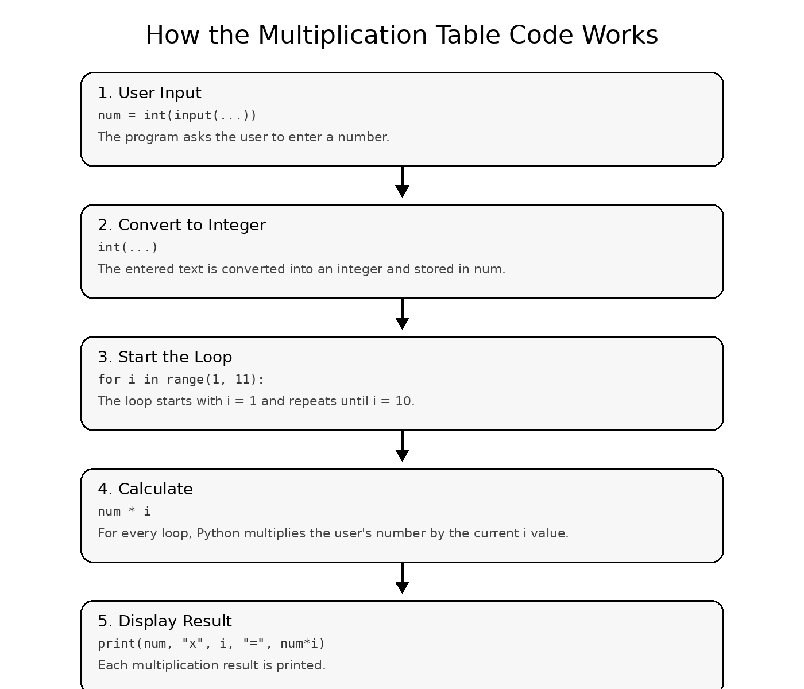
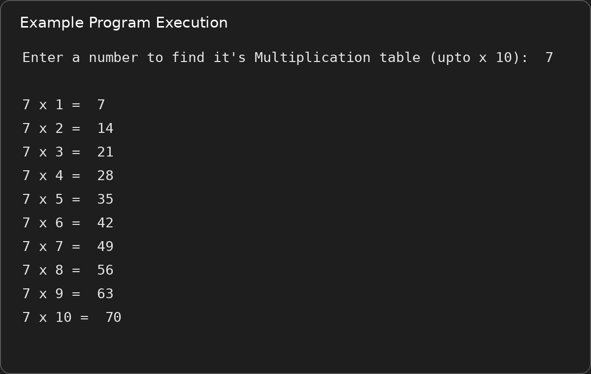

# ✖️ Multiplication Table Creator

A beginner-friendly Python program that creates the multiplication table of a number from **1 to 10**.


---

## 📖 About the Project

This program asks the user to enter a number and then uses a `for` loop to print its multiplication table up to **10**.

This project helps practice:

- `input()`
- `int()`
- Variables
- `for` loops
- `range()`
- Multiplication
- `print()`

---

## 💻 Code

```python
num = int(input("Enter a number to find it's Multiplication table (upto x 10):  "))

for i in range(1, 11):
    print(num, "x", i, "= ", num * i)
```

---

# 🧠 How the Code Works



## 1️⃣ Getting the Number from the User

```python
num = int(input("Enter a number to find it's Multiplication table (upto x 10):  "))
```

### What happens here?

1. `input()` displays a message and waits for the user to type a value.
2. The value entered by the user is initially treated as **text (a string)**.
3. `int()` converts that text into an **integer**.
4. The integer is stored in the variable `num`.

### Example

If the user enters:

```text
7
```

Then:

```python
num = 7
```

---

## 2️⃣ Starting the Loop

```python
for i in range(1, 11):
```

`range(1, 11)` generates the numbers:

```text
1, 2, 3, 4, 5, 6, 7, 8, 9, 10
```

The loop runs **10 times**.

During each iteration, `i` changes:

| Loop | Value of `i` |
|---|---:|
| 1st | 1 |
| 2nd | 2 |
| 3rd | 3 |
| ... | ... |
| 10th | 10 |

---

## 3️⃣ Performing the Multiplication

```python
num * i
```

Suppose the user entered:

```text
7
```

During the first loop:

```python
num = 7
i = 1

7 * 1 = 7
```

During the second loop:

```python
num = 7
i = 2

7 * 2 = 14
```

This continues until `i` reaches `10`.

---

## 4️⃣ Printing the Result

```python
print(num, "x", i, "= ", num * i)
```

Python combines the values and displays them.

For example:

```text
7 x 1 = 7
```

Then:

```text
7 x 2 = 14
```

And the process continues until:

```text
7 x 10 = 70
```

---

# 🔄 Complete Execution Flow

```text
User enters a number
        ↓
input() receives the value
        ↓
int() converts it to an integer
        ↓
Value is stored in num
        ↓
for loop starts
        ↓
i goes from 1 to 10
        ↓
num × i is calculated
        ↓
Result is printed
        ↓
Loop repeats until i = 10
        ↓
Program ends
```

---

# ▶️ Example Output



---

## 🚀 How to Run

Clone the repository:

```bash
git clone https://github.com/Mihashim4/Python-Full-Stack-Learning-Journey.git
```

Navigate to this project:

```bash
cd Python-Full-Stack-Learning-Journey/projects/06-Python-Works-Roadmap/03-Multiplication-Table-Creator
```

Run the program:

```bash
python multiplication_table.py
```

---

## 📂 Project Structure

```text
03-Multiplication-Table-Creator/
│
├── multiplication_table.py
├── README.md
│
└── images/
    ├── code-working.png
    └── example-output.png
```

---

## 📚 Concepts Practiced

| Concept | Purpose |
|---|---|
| `input()` | Gets the number from the user |
| `int()` | Converts the input into an integer |
| `num` | Stores the user's number |
| `for` loop | Repeats the multiplication process |
| `range(1, 11)` | Generates values from 1 to 10 |
| `num * i` | Calculates the multiplication |
| `print()` | Displays each result |

---

## 🔮 Possible Improvements

- [ ] Let the user choose the ending limit
- [ ] Add validation for invalid input
- [ ] Generate tables for multiple numbers
- [ ] Create a GUI version
- [ ] Save the table to a file

---

### ⭐ Part of My Python Full Stack Learning Journey

**Keep Learning • Keep Building • Keep Improving 🚀**
