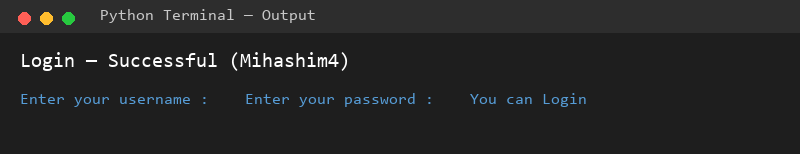

# 06 - Python Works Roadmap

A collection of small Python practice projects I built while learning the language fundamentals. Each subfolder is a self-contained mini-project focused on a specific concept (conditionals, nested if/else, user input, etc.).

## 🎯 What This Section Covers

- Taking user input with `input()`
- `if` / `elif` / `else` decision making
- Nested conditional logic
- Writing clean, readable beginner-level Python

## 📂 Projects in This Section

| # | Project | Concept |
|---|---------|---------|
| 01 | [Grade Calculator](./01-Grade-Calculator/) | if/elif/else based on numeric marks |
| 02 | [Database Username & Password Login](./02-Database-Username-Password-Identifiying-And-Continue-Login/) | Nested if/else for credential checking |

## ▶️ How to Run Any Project

```bash
cd <project-folder>
python <script_name>.py
```

> 💡 These projects are beginner exercises and intentionally simple. They mark early milestones in my Python learning journey.

## 📸 Screenshots

| Project | Output |
|---------|--------|
| 01 - Grade Calculator |  |
| 02 - Login System |  |
